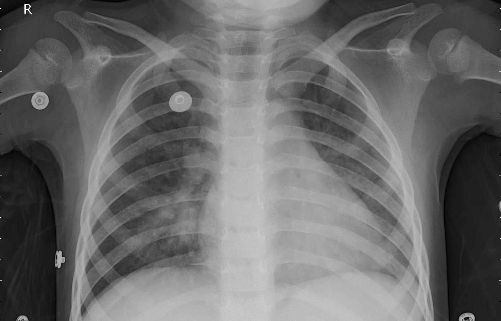
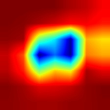
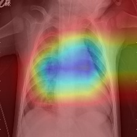

# ỨNG DỤNG PHÁT HIỆN VIÊM PHỔI TỪ ẢNH X-QUANG NGỰC

---

## Tổng quan

Dự án này sử dụng mô hình học sâu **MobileNetV2 / Xception** để phát hiện **bệnh viêm phổi (Pneumonia)** từ ảnh X-quang ngực.  
Bộ dữ liệu được thu thập từ **Trung tâm Y tế Phụ nữ và Trẻ em Quảng Châu (Trung Quốc)**, bao gồm các ảnh X-quang của trẻ từ 1–5 tuổi, được chẩn đoán và gán nhãn bởi hai bác sĩ chuyên khoa hô hấp.

Mô hình được tích hợp **Grad-CAM (Gradient-weighted Class Activation Mapping)** để trực quan hóa vùng phổi mà hệ thống tập trung vào khi ra quyết định.

Ứng dụng được xây dựng bằng **TensorFlow + Flask**, cho phép người dùng tải ảnh X-quang lên và nhận kết quả dự đoán cùng bản đồ kích hoạt (heatmap) trực tiếp trên giao diện web.

---

## 1 Mục tiêu

- Tự động phân loại ảnh X-quang thành **Bình thường (Normal)** hoặc **Viêm phổi (Pneumonia)**.
- Trực quan hóa khu vực nghi ngờ bằng **Grad-CAM** để tăng tính minh bạch của mô hình.
- Cung cấp giao diện web đơn giản, thân thiện, dễ sử dụng cho người dùng không chuyên kỹ thuật.

---

## 2 Dữ liệu

**Nguồn:** [Chest X-Ray Images (Pneumonia) – Kaggle Dataset](https://www.kaggle.com/datasets/ghost5612/chest-x-ray-images-normal-and-pneumonia)

**Tổng cộng:** 5.887 ảnh JPEG, chia theo ba tập:

| Tập dữ liệu | Số ảnh | NORMAL        | PNEUMONIA     |
| ----------- | ------ | ------------- | ------------- |
| Train       | 5.216  | 1.341 (25.7%) | 3.875 (74.3%) |
| Validation  | 47     | 24 (51%)      | 23 (49%)      |
| Test        | 624    | 234 (37.5%)   | 390 (62.5%)   |

---

## 3 Công nghệ sử dụng

| Thành phần              | Công cụ / Thư viện                          |
| ----------------------- | ------------------------------------------- |
| Ngôn ngữ                | Python 3.11                                 |
| Học sâu (Deep Learning) | TensorFlow / Keras                          |
| Framework web           | Flask                                       |
| Xử lý ảnh               | OpenCV, NumPy                               |
| Trực quan hóa           | Matplotlib, cv2 colormap (JET / VIRIDIS)    |
| Triển khai              | Localhost, Render, hoặc Hugging Face Spaces |

---

## 4 Cách chạy ứng dụng

- Bước 1. Tải mã nguồn :

```
git clone https://github.com/minhsuy/chest_xray_web.git

cd chest_xray_web

```

- Bước 2. Tạo và kích hoạt môi trường ảo :

```
python -m venv venv

venv\Scripts\activate       # Windows
# hoặc

source venv/bin/activate    # macOS / Linux
```

- Bước 3. Cài đặt các thư viện cần thiết :

```
pip install -r requirements.txt
```

- Bước 4 : Tải mô hình huấn luyện :

- Bước 5. Chạy ứng dụng :

```

python app.py

```

- Bước 6. Mở trình duyệt :

```

- Browser : http://127.0.0.1:5000 hoặc http://127.0.0.1:7860

- Sau đó tải ảnh X-quang lên để xem:

   Kết quả dự đoán: Bình thường hoặc Viêm phổi

   Xác suất dự đoán (%)

   Bản đồ Grad-CAM tô sáng vùng phổi mà mô hình nhận diện là đáng ngờ

```

## 5 Kết quả mô hình

```

| Chỉ số                  | Giá trị |
| ----------------------- | ------- |
| Độ chính xác (Accuracy) | 88.46%  |

```

## 6 Ví dụ kết quả trực quan :

| Ảnh gốc                                            | Bản đồ kích hoạt (Grad-CAM)                                | Ảnh chồng (Overlay)                                           |
| -------------------------------------------------- | ---------------------------------------------------------- | ------------------------------------------------------------- |
|  |  |  |

## 7 Cấu trúc thư mục

```

chest_xray_web/
├── app.py # Flask web app
├── xception_chestxray_finetuned1810.h5 # Mô hình đã huấn luyện
├── requirements.txt # Danh sách thư viện cần thiết
├── templates/
│ └── index.html # Giao diện người dùng
├── static/
│ ├── uploads/ # Ảnh do người dùng tải lên
│ └── results/ # Ảnh kết quả Grad-CAM
└── README.md

```

```

```

# Hướng dẫn Train mô hình

## 1 Mục tiêu

Huấn luyện các mô hình học sâu để phát hiện bệnh viêm phổi (Pneumonia) từ ảnh chụp X-ray.
Hai mô hình được huấn luyện song song để so sánh:

**_ Xception – mô hình mạnh, cho độ chính xác cao._**

**_ MobileNetV2 – mô hình nhẹ, tốc độ nhanh, phù hợp deploy thực tế._**

## 2 Chuẩn bị dữ liệu

**Nguồn:** [Chest X-Ray Images (Pneumonia) – Kaggle Dataset](https://www.kaggle.com/datasets/ghost5612/chest-x-ray-images-normal-and-pneumonia)

Số lượng ảnh: ~5.800 ảnh

Nhãn: NORMAL / PNEUMONIA

Sau khi tải về, cấu trúc dữ liệu như sau:

```
chest_xray/
├── train/
│   ├── NORMAL/
│   └── PNEUMONIA/
├── val/
│   ├── NORMAL/
│   └── PNEUMONIA/
└── test/
    ├── NORMAL/
    └── PNEUMONIA/
```

Chia dữ liệu thành ba phần:

- train: dùng để huấn luyện mô hình (≈70%)

- val: dùng để kiểm tra khi huấn luyện (≈15%)

- test: dùng để đánh giá cuối cùng (≈15%)

Các mô hình đã được nhóm huấn luyện sẵn có thể tải tại đây:
**_Google Drive Folder_**: (https://drive.google.com/drive/folders/1Iya9tv86Oo_ok1hR4eQnLc_8qNr0SI6-)

## 3 Tiền xử lý & Augmentation

Để tăng tính tổng quát và giảm overfitting, áp dụng các phép Data Augmentation:

```
train_datagen = ImageDataGenerator(
    rescale=1./255,
    rotation_range=25,
    width_shift_range=0.1,
    height_shift_range=0.1,
    zoom_range=0.2,
    shear_range=0.1,
    horizontal_flip=True
)
```

→ giúp mô hình học được nhiều biến thể khác nhau của ảnh X-ray (xoay, phóng to, lật,...).

Các ảnh validation & test chỉ chuẩn hoá về [0,1].

## 4️ Xây dựng mô hình (Transfer Learning)

Sử dụng mô hình pretrained trên ImageNet, loại bỏ phần fully-connected gốc và thêm đầu ra riêng.

(a) Xception

```
base_model = Xception(
    input_shape=(224,224,3),
    include_top=False,
    weights='imagenet'
)
base_model.trainable = False
model = Sequential([
    base_model,
    GlobalAveragePooling2D(),
    Dropout(0.3),
    Dense(1, activation='sigmoid')
])
```

(b) MobileNetV2

```
base_model = MobileNetV2(
    input_shape=(224,224,3),
    include_top=False,
    weights='imagenet'
)
base_model.trainable = False
model = Sequential([
    base_model,
    GlobalAveragePooling2D(),
    Dropout(0.3),
    Dense(1, activation='sigmoid')
])
```

## 5 Huấn luyện giai đoạn 1 (Transfer Learning)

Đóng băng toàn bộ trọng số gốc của mô hình ImageNet.
Chỉ train phần classification head (2–3 lớp cuối).
Dùng **_optimizer='adam', loss='binary_crossentropy', epochs=10._**
Callback:

```
EarlyStopping(monitor='val_loss', patience=3)

ReduceLROnPlateau(monitor='val_loss', factor=0.3, patience=2)
```

## 6 Huấn luyện giai đoạn 2 (Fine-Tuning)

Mở băng 20 lớp cuối (Xception) hoặc 10 lớp cuối (MobileNetV2).

Giảm learning rate xuống 1e-5.

Train thêm 5–10 epochs.
Lưu mô hình kết quả:

```
models/xception_chestxray_finetuned.h5
models/mobilenetv2_chestxray_finetuned.h5
```

## 7 Đánh giá mô hình

Đánh giá trên tập test:

```
test_loss, test_acc = model.evaluate(test_gen)
```

In thêm Confusion Matrix & Classification Report để thấy mức độ phân biệt giữa NORMAL và PNEUMONIA.

Vẽ biểu đồ Accuracy / Loss qua các epoch:

```
plt.plot(history.history['accuracy'])
plt.plot(history.history['val_accuracy'])
```

## 8 Phân tích Grad-CAM

Dùng Grad-CAM để trực quan hóa vùng mà mô hình chú ý khi dự đoán.
Kết quả cho thấy vùng phổi bị mờ hoặc trắng (viêm) được mô hình tập trung vào → xác nhận mô hình học đúng đặc trưng y khoa

## 9 Kết luận

| Mô hình     | Test Accuracy | Ưu điểm                   | Nhược điểm        |
| ----------- | ------------- | ------------------------- | ----------------- |
| Xception    | ~96%          | Chính xác cao, heatmap rõ | Chạy chậm hơn     |
| MobileNetV2 | ~93%          | Nhẹ, tốc độ nhanh         | Kém chính xác hơn |
